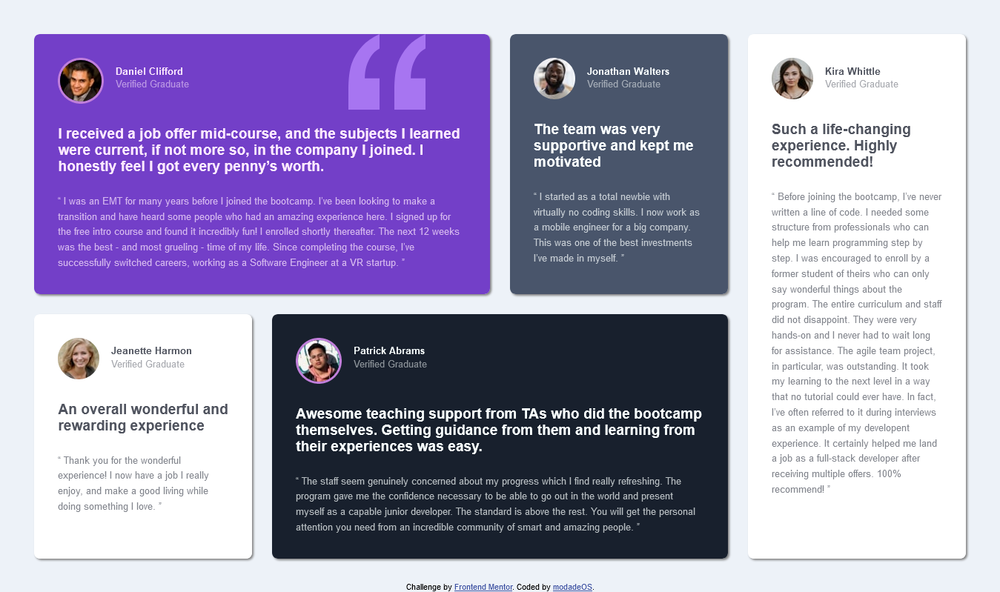

# Frontend Mentor - Testimonials grid section solution

This is a solution to the [Testimonials grid section challenge on Frontend Mentor](https://www.frontendmentor.io/challenges/testimonials-grid-section-Nnw6J7Un7). Frontend Mentor challenges help you improve your coding skills by building realistic projects. 

## Table of contents
- [Overview](#overview)
  - [The challenge](#the-challenge)
  - [Screenshot](#screenshot)
  - [Links](#links)
- [My process](#my-process)
  - [Built with](#built-with)
  - [What I learned](#what-i-learned)
  - [Continued development](#continued-development)
  - [Useful resources](#useful-resources)
- [Author](#author)

## Overview
This solution focuses on using CSS Grid in making this testimonial template layout, other CSS tools were used as well to try to achieve a layout that's very similar to the original design.   

### The challenge
- The challenge this time was to create a testimonial grid section of a web page based on the design provided in the folders for both mobile(375) and desktop.
Users should be able to:
- View the optimal layout for the site depending on their device's screen size

### Screenshot
.png)

## My process
The process of building this template started with applying the proper semantic HTML markups followed by styling it with Vanilla CSS, Grid Media queries were used in the building of this template.

### Built with
- Semantic HTML5 markup
- CSS custom properties
- CSS Grid
- Mobile-first workflow

### What I learned
This challenge has helped me in learning CSS although not to perfection yet but i can now do tasks with it and i believe going forward it will become easier, hopefully.

### Continued development
Going forward i will definitely be using a lot of CSS Grid although not easy, but its something i want to continue doing.

### Useful resources
Some Resources i found useful as i did this project include 
- [Resource 1](www.w3schools.com/css/)
- [Resource 2](https://youtu.be/rg7Fvvl3taU) - This is an amazing video tutorial which helped me in my understanding on CSS Grid. I'd recommend it to anyone still learning this CSS Grid.

## Author
- Frontend Mentor - [@modade97](https://www.frontendmentor.io/profile/@modade97)
- Twitter - [@modadegospel](https://www.twitter.com/@modadegospel)

